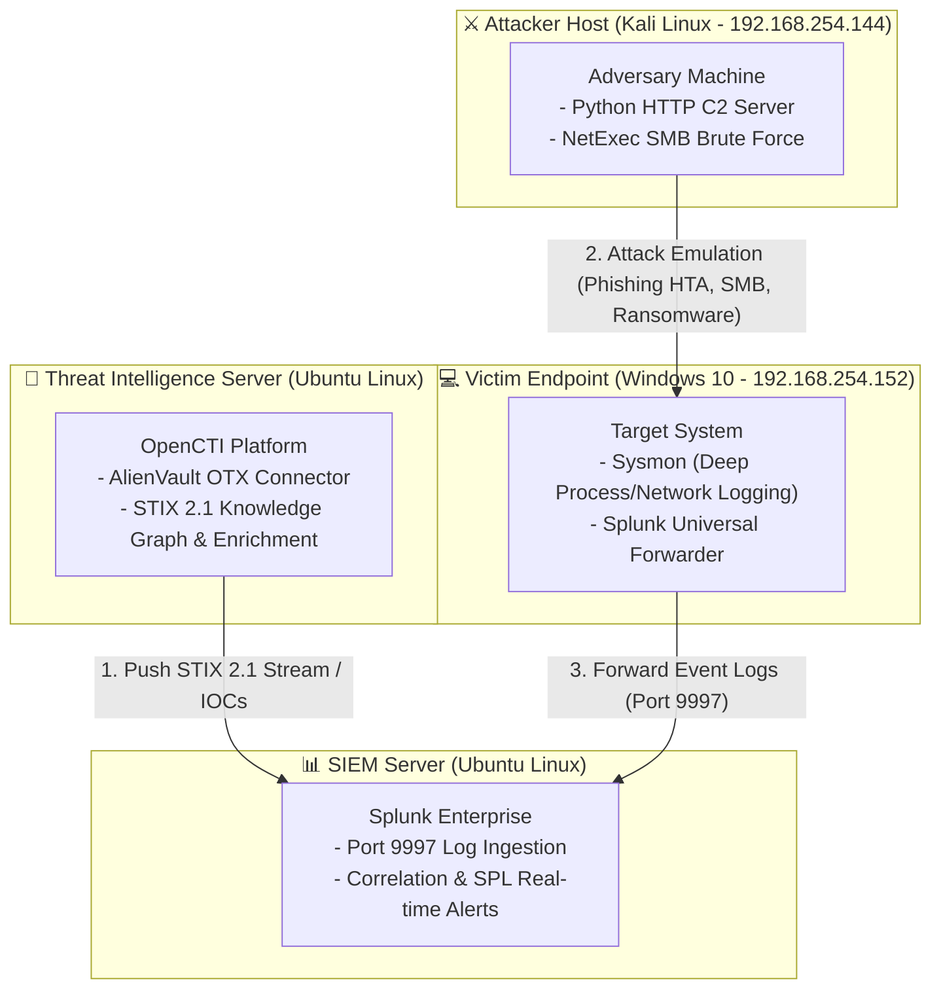

# 🛡️ Cyber Threat Intelligence (CTI) & SIEM Integration Platform
> **Enterprise Threat Detection, Behavioral Analysis & Incident Response using OpenCTI, Splunk, and Sysmon**

[](#)
[](#)
[](#)

---

## 📌 Project Overview
Dự án nghiên cứu và xây dựng mô hình phòng thủ an ninh mạng tích hợp giữa **Nền tảng Tình báo Mối đe dọa (Cyber Threat Intelligence - OpenCTI)** và **Hệ thống Quản lý Sự kiện & Thông tin An ninh (SIEM - Splunk Enterprise)**. 

Hệ thống cho phép:
1. Tự động thu thập dữ liệu tình báo (IOCs, Threat Actors, TTPs) từ nguồn mở quốc tế (**AlienVault OTX**) theo chuẩn **STIX 2.1 / TAXII**.
2. Đồng bộ hóa các chỉ số thỏa hiệp (IOCs) sang hệ thống SIEM **Splunk**.
3. Thu thập toàn diện nhật ký hành vi máy trạm thông qua **Sysmon** và **Splunk Universal Forwarder**.
4. Phát hiện tấn công theo thời gian thực (Real-time Alerting) và kích hoạt quy trình phản ứng sự cố (Incident Response).

---

## 👤 Tuyên bố Đóng góp Cá nhân (Personal Contribution)
> **Ghi chú**: Đề tài xuất phát từ bài tập lớn môn *Kỹ thuật theo dõi & Giám sát An toàn mạng* (Học viện Công nghệ Bưu chính Viễn thông - PTIT). 
> 
> Trong dự án này, **tôi đã trực tiếp tự tay nghiên cứu, cài đặt toàn bộ hạ tầng phòng lab từ đầu (OpenCTI, Splunk, Sysmon, Forwarder)** và **thiết kế, thực thi trọn vẹn 3 kịch bản tấn công - phòng thủ thực chiến**:
> - **Kịch bản 1**: Giám sát và phát hiện tấn công Phishing HTA qua Splunk & OpenCTI.
> - **Kịch bản 2**: Giám sát và phát hiện tấn công dò đoán mật khẩu mạng (SMB Brute Force).
> - **Kịch bản 3**: Phát hiện Ransomware theo hành vi (Behavioral Detection) và ứng phó bằng OpenCTI.

## 🏗️ Kiến trúc Môi trường Lab (System Architecture)



## 🎯 3 Kịch bản Tấn công & Phát hiện Trọng tâm

### 1. Phát hiện Tấn công Phishing HTA & Lạm dụng LOLBins (T1204 / T1218.005)
* **Mô phỏng tấn công (Red Team)**:
  * Xây dựng trang web Phishing giả mạo cổng tuyển sinh PTIT (`huongdan.zip`).
  * Sử dụng tệp **HTML Application (`.hta`)** ngụy trang. Khi nạn nhân mở file, Windows kích hoạt công cụ hợp pháp `mshta.exe` (kỹ thuật **Living off the Land - LOLBins**) để âm thầm gọi PowerShell tải mã độc `connect.txt` từ C2 Server (`192.168.254.144:8080`).
* **Giám sát & Săn tìm (Blue Team - Splunk)**:
  * Truy vấn nhật ký Sysmon (*EventCode 1 - Process Creation*) để phát hiện chuỗi tiến trình cha-con bất thường (`mshta.exe` $\rightarrow$ `powershell.exe` với tham số `Invoke-WebRequest` tải file ngầm):
    ```spl
    index="victim_win10" EventCode=1 "*mshta.exe*" "*powershell.exe*"
    ```
  * Cấu hình **Real-time Alert** mức độ **Critical** tự động kích hoạt khi xuất hiện chuỗi hành vi trên.
* **Tích hợp Tình báo & Làm giàu dữ liệu (OpenCTI)**:
  * Trích xuất địa chỉ IP C2 (`192.168.254.144`) và mã băm SHA-256 của tệp HTA nạp vào OpenCTI theo định dạng chuẩn STIX 2.1.
  * Thiết lập liên kết quan hệ (`Related-to`) giữa mã độc và máy chủ C2 trên đồ thị tri thức (Knowledge Graph).

---

### 2. Phát hiện Dò đoán Mật khẩu qua Mạng (SMB Brute Force - T1110.001)
* **Mô phỏng tấn công (Red Team)**:
  * Sử dụng công cụ **NetExec (`nxc`)** trên Kali Linux thực hiện rà quét và thử liên tục danh sách từ điển mật khẩu vào tài khoản `Administrator` qua giao thức SMB (`Port 445`):
    ```bash
    nxc smb 192.168.254.152 -u Administrator -p pass.txt
    ```
* **Giám sát & Phát hiện (Blue Team - Splunk)**:
  * Nhận diện dấu hiệu tấn công thông qua chuỗi sự kiện **Windows Security EventCode 4625** (Audit Logon Failure) với cờ **`Logon_Type=3`** (xác định đăng nhập qua đường truyền mạng thay vì ngồi trực tiếp):
    ```spl
    index="victim_win10" EventCode=4625 Logon_Type=3 
    | stats count by Account_Name, Source_Network_Address 
    | where count > 5
    ```
  * Thiết lập cảnh báo tự động khi tần suất đăng nhập sai vượt ngưỡng 5 lần/phút.
* **Định danh & Gắn nhãn CTI (OpenCTI)**:
  * Tự động đưa IP tấn công (`192.168.241.134`) vào OpenCTI, gắn nhãn **`Brute Forcer`** và ánh xạ kỹ thuật MITRE ATT&CK **T1110.001**.

---

### 3. Phát hiện Ransomware theo Hành vi & Ứng phó Sự cố (T1486 / T1059.001)
* **Mô phỏng tấn công an toàn (Red Team - Safe Emulation)**:
  * Không sử dụng mã độc tống tiền thật để tránh rủi ro phá hoại hệ thống. Thay vào đó, áp dụng kỹ thuật LOLBins dùng PowerShell chạy ngầm giả lập hành vi đổi đuôi file hàng loạt thành `.lockbit` và thả tệp tống tiền `README_DECRYPT.txt`:
    ```cmd
    powershell.exe -WindowStyle Hidden -ExecutionPolicy Bypass -Command "Get-ChildItem C:\Users\Public\TaiLieuQuanTrong\*.docx | Rename-Item -NewName { $_.Name + '.lockbit' }; echo 'Toan bo du lieu da bi ma hoa, tra 1 Bitcoin.' > C:\Users\Public\TaiLieuQuanTrong\README_DECRYPT.txt"
    ```
* **Phát hiện theo Hành vi Lõi (Behavioral Detection - Splunk)**:
  * Tư duy phòng thủ Zero-day: Thay vì chỉ bắt theo tên file cụ thể (dễ bị vượt mặt), cấu hình luật bắt hành vi: *Tiến trình chạy ẩn (`-WindowStyle Hidden`) kết hợp lệnh đổi tên tệp tin (`Rename-Item`)*:
    ```spl
    index="victim_win10" "EventID>1</EventID>" "powershell.exe" "-WindowStyle Hidden" "Rename-Item"
    | rex field=_raw "<Data Name='CommandLine'>(?<CommandLine>[^<]+)</Data>"
    | table _time, host, Image, CommandLine
    ```
* **Định danh Kẻ thù & Quyết định Ứng phó Sự cố (OpenCTI & IR)**:
  * Tra cứu IOC đuôi file `.lockbit` trên OpenCTI, xác định chính xác mẫu đe dọa là **LockBit 3.0**.
  * Dựa trên phân tích TTPs (LockBit thường dùng chiến thuật *Double Extortion - Tống tiền kép*: đánh cắp dữ liệu trước khi mã hóa), đội ngũ phòng thủ ban hành **Lệnh cô lập mạng khẩn cấp (Network Isolation)** đối với máy nạn nhân để ngăn chặn quá trình rò rỉ dữ liệu mật.

---

## 🛠️ Công nghệ & Công cụ Sử dụng (Tech Stack)

| Hạng mục | Công nghệ / Công cụ | Vai trò trong Hệ thống |
| :--- | :--- | :--- |
| **CTI Platform** | **OpenCTI** | Quản lý tình báo, chuẩn hóa STIX 2.1, biểu diễn Knowledge Graph |
| **SIEM Platform** | **Splunk Enterprise** | Lưu trữ, lập chỉ mục và phân tích sự kiện bảo mật theo thời gian thực |
| **Log Agent** | **Sysmon v15 + Splunk Forwarder** | Giám sát chi tiết tiến trình (EventCode 1) và kết nối mạng (EventCode 3) |
| **Attacker Tools** | **Kali Linux, NetExec, Python C2** | Mô phỏng các kỹ thuật tấn công APT, Brute Force, Phishing |
| **Intelligence Feeds**| **AlienVault OTX** | Nguồn dữ liệu tình báo mã nguồn mở quốc tế |
| **Standards** | **MITRE ATT&CK, STIX/TAXII** | Tiêu chuẩn hóa danh mục kỹ thuật và mô hình chia sẻ dữ liệu |

---

## 📂 Tài liệu Tham khảo Chi tiết
* Toàn bộ báo cáo nghiên cứu lý thuyết, hình ảnh cấu hình từng bước và nhật ký thực nghiệm chi tiết 78 trang được lưu trữ trong tệp: **Bao_Cao_BTL_Giam_Sat_ATTT_OpenCTI_Splunk.pdf**
